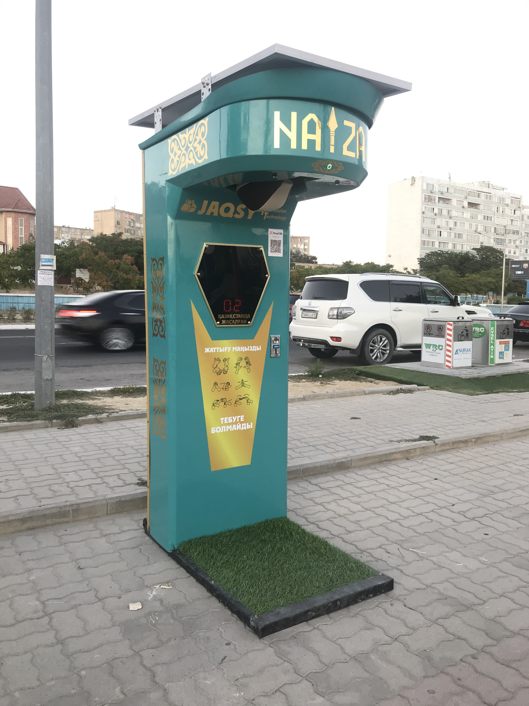
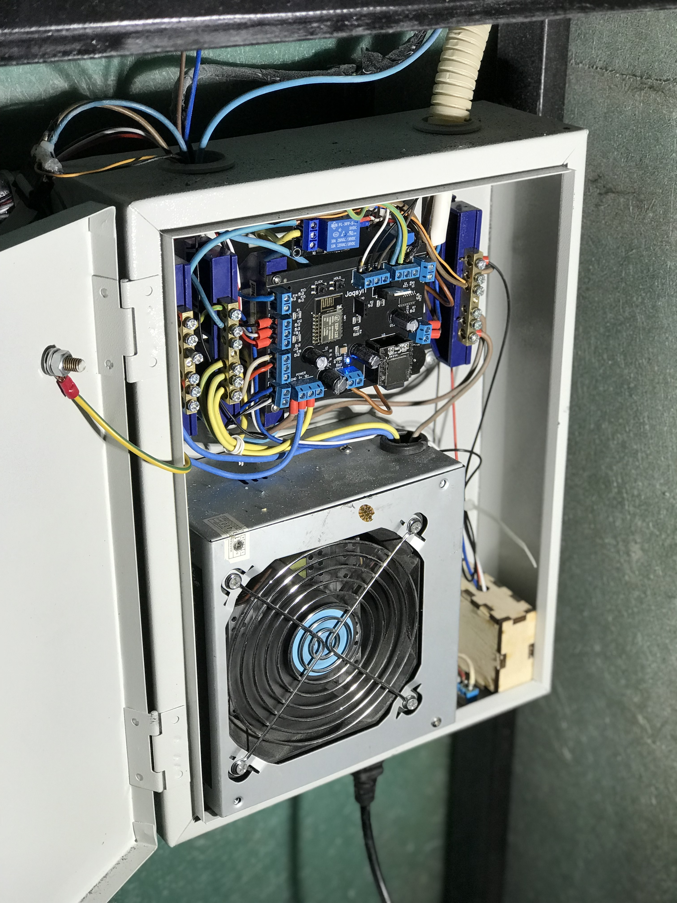

# 🥊Naiza Boxer — Arcade Strength Tester Machine

**Naiza Boxer** is a fully functional arcade punching machine designed and built in Kazakhstan by a team of five. It allows users to compete on their punching power, with an LED display, sound effects, integrated payment systems, and a mechanical reset mechanism.

> I was 19 years old when I developed the firmware, designed the hardware, and led the electrical system architecture.

---

## 📷 Photos

### Machine in use:


### Schematic:


---

## 🔥 Viral Reach

Demo videos of Naiza Boxer gained over **500,000** and **100,000** views on TikTok:

- 🎥 [Watch (500K+ views)](https://vm.tiktok.com/ZMSk7nHwa/)
- 🎥 [Watch (100K+ views)](https://vm.tiktok.com/ZMSk7WPcM/)

---

## 🎯 Features

- **Punch detection** using an FC-33 optical sensor, measuring time to determine impact force.
- **WS2812B-based LED matrix display** for real-time animations and countdown.
- **DFPlayer Mini MP3 playback**, with localized Kazakh audio by impact strength category.
- **Supports payments via coins, bills, and QR codes** (including Kazakh bank QR system).
- **Electromechanical bag reset** using an automotive solenoid actuator.
- **Non-blocking firmware** built around `millis()` with interrupt-driven input handling.
- **Noise immunity** through shielding, power isolation, and signal filtering.

---

## 🧠 My Role

- Designed two custom PCBs (controller & display) using EasyEDA.
- Developed firmware for ESP8266 using Arduino IDE.
- Integrated sound system, lighting effects, input handling, and external hardware.
- Solved EMI and signal noise via engineering best practices.
- Built system logic using non-blocking architecture (`millis()`, ISR, event flow).
- Led full wiring/electrical design and modular layout for maintenance and upgrades.

---

## 🛠️ Hardware Overview

### Controller Board
- `Schematic_NAIZA_CONTROLLER.pdf` – Full circuit diagram
- `PCB_NAIZA_CONTROLLER.pdf` – PCB trace view
- `maincontroller_PCB.jpg` – 3D render of the board
- `Gerber_NAIZA_CONTROLLER_PCB.zip` – Gerber files for manufacturing
- `BOM_NAIZA_CONTROLLER.xlsx` – Bill of materials
- **USB-to-UART programming** supported via dedicated header on the PCB

### Display Board
- `Schematic_NAIZA_DISPLAY.pdf` – Full circuit diagram
- `PCB_boxDisp.pdf` – PCB trace view
- `display_PCB.jpg` – 3D render of the board
- `Gerber_NAIZA_DISPLAY_PCB.zip` – Gerber files for manufacturing
- `BOM_NAIZA_DISPLAY.xlsx` – Bill of materials

---

## 📁 Project Structure

```

Naiza-Boxer/
├── firmware/
│   └── src/
│       └── main.ino
│
├── hardware/
│   ├── controller-board/
│   │   ├── BOM\_NAIZA\_CONTROLLER.xlsx
│   │   ├── Gerber\_NAIZA\_CONTROLLER\_PCB.zip
│   │   ├── maincontroller\_PCB.jpg
│   │   ├── PCB\_NAIZA\_CONTROLLER.pdf
│   │   └── Schematic\_NAIZA\_CONTROLLER.pdf
│   └── display-board/
│       ├── BOM\_NAIZA\_DISPLAY.xlsx
│       ├── Gerber\_NAIZA\_DISPLAY\_PCB.zip
│       ├── display\_PCB.jpg
│       ├── PCB\_boxDisp.pdf
│       └── Schematic\_NAIZA\_DISPLAY.pdf
│
├── media/
│   ├── photos/
│   └── videos/

```
---

## 📬 Contact

If you're interested in the project or want to discuss it in more detail, feel free to reach out or explore the code and schematics.

---

## 🚀 Ready for Production

This is not a prototype or a demo — **Naiza Boxer is a production-ready arcade machine**, built, tested, and deployed by our team with full system integration and engineering validation.
